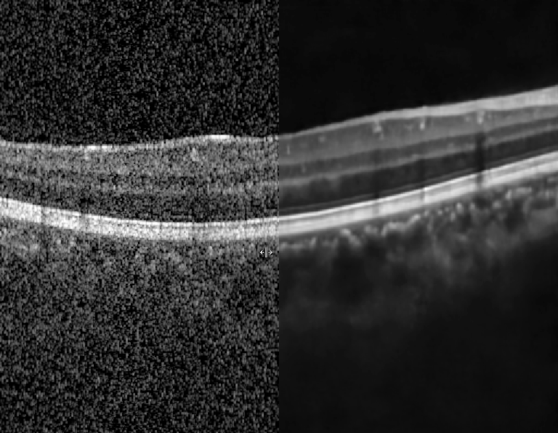

# Self-Supervised Denoising of Optical Coherence Tomography with Inter-Frame Representation

This paper was published in the proceedings of [ICIP2023](https://ieeexplore.ieee.org/abstract/document/10223125)

A 3D U-Net designed for the denoising of OCT volumes based on the Noise2Noise strategy.

## How to run
Place your own OCT volume stack into a folder, then specify the folder path for data_path in train_config.yaml.

## Results



## Citation
If this work is useful for your research, please kindly cite it:
```
@inproceedings{
  author={Liu, Zhengji and Law, Tsz-Kin and Li, Jizhou and To, Chi-Ho and Chun, Rachel Ka-Man},
  booktitle={2023 IEEE International Conference on Image Processing (ICIP)}, 
  title={Self-Supervised Denoising of Optical Coherence Tomography with Inter-Frame Representation}, 
  year={2023},
  pages={3334-3338},
  doi={10.1109/ICIP49359.2023.10223125}}
```
